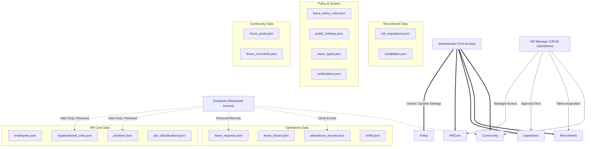

# Database & Role Streamline Map

This document outlines the architectural relationship between the **Database Resources** (extracted JSON data) and the **User Roles** (RBAC). This map is designed to streamline the implementation of the **Settings Screen** and permission management.

## 1. Role-Data Streamline Map

The following diagram visualizes which roles have primary access (Create/Read/Update/Delete) to specific database resources.

---

## 2. Detailed Data-Role Matrix

| Category | Database Resource | Admin | HR Manager | Employee | Settings Impact |
| :--- | :--- | :---: | :---: | :---: | :--- |
| **HR Core** | `employees.json` | CRUD | CRUD | R (Self) | Profile & Account Mgmt |
| | `positions.json` | CRUD | CRUD | R | Org Structure Settings |
| | `organizational_units.json` | CRUD | CRUD | R | Dept/Team Hierarchy |
| | `job_classifications.json` | CRUD | CRUD | R | Job Level Configuration |
| **Ops** | `leave_requests.json` | CRUD | CRUD | CRUD (Self) | Approval Workflows |
| | `attendance_records.json` | CRUD | CRUD | R (Self) | Timekeeping Rules |
| | `shifts.json` | CRUD | CRUD | R | Scheduling Config |
| **Policy** | `leave_policy_rules.json` | CRUD | R | - | **Settings: Policy Config** |
| | `public_holidays.json` | CRUD | R | R | **Settings: Holiday Mgmt** |
| | `leave_types.json` | CRUD | R | R | **Settings: Leave Config** |
| **System** | `notifications.json` | CRUD | R | R (Self) | Notif Preferences |
| **Forum** | `forum_posts.json` | CRUD | CRUD | CR | Community Moderation |

---

## 3. Settings Screen Implementation Guide

To setup the **Settings Screen**, focus on the following resource clusters:

### ⚙️ System Configuration (Admin Only)
- **RBAC Matrix**: Map `Role` to `ModuleConfig` (stored in `lib/rbac.ts`).
- **Policy Management**: UI to edit `leave_policy_rules.json` and `leave_types.json`.
- **Company Calendar**: UI to manage `public_holidays.json`.

### 👤 User Preferences (All Roles)
- **Profile Settings**: Based on `employees.json` (personal details).
- **Notification Settings**: Controlling delivery types for items in `notifications.json`.

### 🏢 Organizational Settings (Admin/HR)
- **Unit Management**: CRUD for `organizational_units.json`.
- **Job Library**: Managing the schema in `job_classifications.json`.

---

> [!TIP]
> Use the **Settings Screen** to provide an interface for updating these JSON resources. In a real production environment, the Settings Screen would act as the UI for these database tables.
